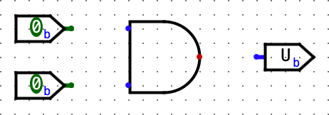
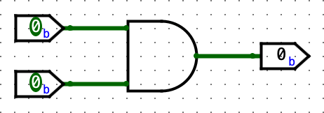
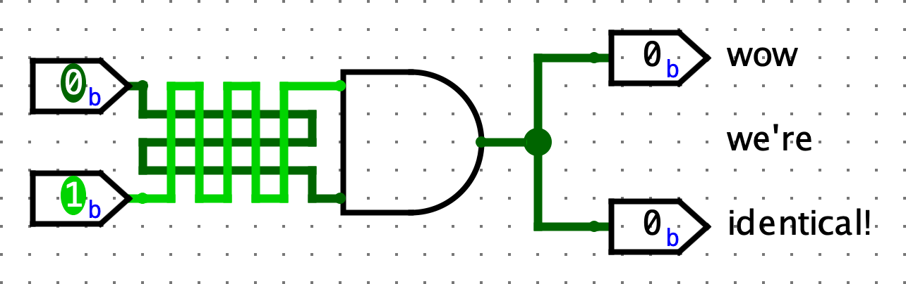
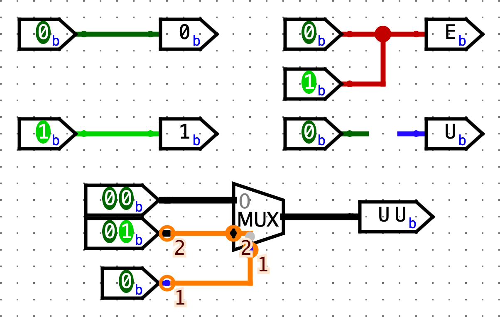

# Digital Logic with Logisim
## Goals

- Get familiar with using the Logisim simulator
- Try to build advances logic circuits

## Introduction

This excercire series introduces [Logisim](http://www.cburch.com/logisim/) - an educational tool for designing and simulating digital logic circuits.

## Exercise 1: Get familiar with Logisim

You can run Logisim from inside the `Digital Logic` folder with
```console
java -jar tools/logisim-evolution.jar # If in a different folder, use the corresponding relative path 
```

After a short startup sequence, a Logisim window should appear. If not, check for errors in your terminal.

### Building a simple circuit

1.   Start by clicking the `AND` gate button. This will cause the shadow of an `AND` gate to follow your cursor around. Click once within the main schematic window to place an `AND` gate.
2.  Click the `Input Pin` button. Now, place two input pins somewhere to the left of your `AND` gate.
3.  Click the `Output Pin` button. Then place an output pin somewhere to the right of your `AND` gate. Your schematic should look something like this at this point:

4.  Click the `Select` tool button. Click and drag to connect the 2 input pins to the 2 inputs on the left side of the `AND` gate. You can only draw vertical and horizontal wires. Just draw a wire horizontally, release the mouse button, then click and drag starting from the end of the wire to continue vertically. Repeat the same procedure to connect the output on the right side of the `AND` gate to the output pin. After completing these steps your schematic should look similar to this:

5.  Finally, the `Poke` tool will toggle the values of the pins when you click on them. If you use the `Poke` tool on a wire, it will display the value on the wire. Select the `Poke` tool, try clicking on the input pins in your schematic, and observe what happens. Does the output match with what you think an `AND` gate should do? Now, try poking a wire directly. The current value on that wire should pop up; this is very useful for more complex circuits.
6. Now, delete the wires, and try wiring each input pin to the other pin on the `AND` gate, in such a way that the wires cross over. An extreme example:

If you're creating a wire and drag it **over** another wire without stopping, the wires will not connect. If you're creating a wire and stop dragging while **on top** of another wire, a junction (big circle) will be created, and the wires will connect. Make sure to pay attention to junctions when you're designing your circuits!

### List of Wire Colors and Values

Please take a look at this list. It may help to try re-creating each color on your own.

| Color       | Meaning |
| ----------- | ----------- |
| Dark green      | 1-bit wire has a value of 0       |
| Bright green  | 1-bit wire has a value of 1       |
|Black|Multi-bit wire (many components have bit width attributes which can be configured in the attributes menu on the bottom left)|
|Red (values with `EEEE`)|The wire has multiple values on it (in this case, a `0` and `1` from the two inputs). Also, remember that a big circle appears at wire junctions.|
|Blue (values with `UUUU`)|The wire is floating (i.e. has no known value)|
|Orange|The wire is connected to components that have different bit widths. A simple example is a 1-bit input pin connected to a 2-bit output pin. In the shown example, there is a slightly hidden wire behind the `MUX` connecting the 2-bit lower data line to the 1-bit select line. Watch out for these!|


In this exercise, we are giving you the implementation of fib in both c and assembly. Take a look at both files. You also may need to check [RISC-V-Reference](https://didatticaonline.unitn.it/dol/mod/resource/view.php?id=1050250) and [RISC-V Calling Converntion](https://didatticaonline.unitn.it/dol/mod/resource/view.php?id=1050253).

At the top of `fib.s`, you can see the `.data`, `.word`, `.text` directives.

- `.data`: Denotes where global variables are declared
- `.word`: Allocates and initializes space for a 4-byte variable in the data segment.
- `.text`: Indicates the start of the code.

We have added comments to `fib.s` to help you understand the program. There are two new instructions:

- `la n`: loads the address of the label where `n` is located. It is a pseudo instruction that breaks down into the instructions `auipc` and `addi`. Take a look at your reference card to see what `auipc` does.
- `ecall`: The ecall instruction is used to perform system calls or request other privileged operations such as accessing the file system or writing output to console. In this class, we will mostly be using ecall to exit or to print integers. To specify which action the `ecall` should take, you will pass a code to `ecall` through `a0`. To terminate the program, you set `a0` to `10`. To print an integer, you will set `a0` to `1` and set `a1` to the integer that you want to print.

### Quiz

Try to run `fib.s` with Venus and answers the following questions.

1. Run the program to completion. What number did the program output? What does this number represent?
2. At what address is `n` stored in memory? Hint: Step through the code and look at the contents of the registers.
3. How would you compute the 20th fibonacci number?

## Exercise 2: From C to RISC-V

Open the files `sum.c` and `sum.s`. The assembly code provided (`.s` file) is a translation of the given C program into RISC-V.

### Quiz

Find and identify the following components of this assembly file, and be able to explain how they work.

1. The register representing the variable `k`.
2. The register representing the variable `sum`.
3. The registers acting as pointers to the `source` and `dest` arrays.
4. The assembly code for the loop found in the C code.
5. How the pointers are manipulated in the assembly code.

## Exercise 3: Factorial

In this exercise, you will be implementing the `factorial` function in RISC-V. This function takes in a single integer parameter `n` and returns `n!`. A stub of this function can be found in the file `factorial.s`.

The argument that is passed into the function is located at the label `n`. You can modify `n` to test different factorials. To implement, you will need to add instructions under the `factorial` label. Note that you may find it helpful to add additional labels to simplify control flow. We recommend that you implement the iterative solution, but you are welcome to implement the recursive solution. You can assume that the `factorial` function will only be called on positive values with results that won't overflow a 32-bit two's complement integer.

### Action

Complete the code at the comment line `# YOUR CODE HERE` and make sure that your function properly returns, for example, `3! = 6`, `7! = 5040`, and `8! = 40320`.

## Exercise 4: Call a RISC-V function with `map`

This exercise uses the file `list_map.s`.

In this exercise, you will complete the implementation of [map](https://en.wikipedia.org/wiki/Map_(higher-order_function)) on linked lists in RISC-V. The function will be simplified to mutate the list in-place, rather than creating and returning a new list with the modified values.

You will find it helpful to refer to the [RISC-V-Reference](https://didatticaonline.unitn.it/dol/mod/resource/view.php?id=1050250) to complete this exercise. If you encounter any instructions or pseudo-instructions you are unfamiliar with, use this as a resource.

Your `map` procedure will take two parameters. The first parameter will be **the address of the head node** of a singly linked list whose values are 32-bit integers. So, in C, the structure would be defined as:

```c
struct node {
    int value;
    struct node *next;
};
```

The second parameter will be **the address of a function** that takes one `int` as an argument and returns an `int`. We'll use the `jalr` RISC-V instruction to call this function on the list node values (check yourself how `jalr` works).

The `map` function will recursively go down the list, applying the function to each value of the list and storing the value returned in that corresponding node. In C, the function would be something like this:

```c
void map(struct node *head, int (*f)(int)) 
{
    if (!head) { return; }
    head->value = f(head->value);
    map(head->next,f);
}
```

If you haven't seen the int `(*f)(int)` kind of declaration before, don't worry too much about it. Basically, it means that `f` is a pointer to a function that takes an `int` as an argument. We can call this function `f` just like any other.

There are exactly ten (10) markers (1 in `done`, 7 in `map`, and 2 in `main`) in the provided code where it says `# YOUR CODE HERE`.

### Action

Complete the implementation of `map` by filling out each of these ten markers with the appropriate code. Furthermore, provide a call to `map` with `square` as the function argument. There are comments in the code that explain what should be accomplished at each marker. When you've filled in these instructions, running the code should provide you with the following output:

```
9 8 7 6 5 4 3 2 1 0 
81 64 49 36 25 16 9 4 1 0 
80 63 48 35 24 15 8 3 0 -1 
```

The first line is the original list, and the second line is the list with all elements squared after calling `map(head, &square)`, and the third is the list with all elements decremented after now calling `map(head, &decrement)`.

Do not forger to check that your code satisfies the [RISC-V Calling Converntion](https://didatticaonline.unitn.it/dol/mod/resource/view.php?id=1050253), so make sure you are saving and loading where necessary.

## Exercise 5: Array Practice

Consider the discrete-valued function f defined on integers in the set {-3, -2, -1, 0, 1, 2, 3}. Here's the function definition:

```
f(-3) = 6
f(-2) = 61
f(-1) = 17
f(0) = -38
f(1) = 19
f(2) = 42
f(3) = 5
```

### Action

Implement the function in `discrete_fn.s` in RISC-V, with the condition that your code may **NOT** use any branch and/or jump instructions! We have provided some hints in case you get stuck.

Note that you can shorten `jal ra, label` to `jal label`. These two lines do the same thing.
<details>
    <summary>Hint 1</summary>
    <br>
    All of the output values are stored in the output array which is passed to <code>f</code> through register <code>a1</code>. You can index into that array to get the output corresponding to the input.
</details>
<details>
    <summary>Hint 2</summary>
    <br>
    You can access the values of the array using <code>lw</code>.
</details>
<details>
    <summary>Hint 3</summary>
    <br>
    <code>lw</code> requires that the offset is an immediate value. When we compute the offset for this problem, it will be stored in a register. Since we cannot use a register as the offset, we can add the value stored in the register to the base address to compute the address of the index that we are interested in. Then we can perform a <code>lw</code> with an offset of <code>0</code>.
    <br>
    In the following example, the index is stored in <code>t0</code> and the pointer to the array is stored in <code>t1</code>. The size of each element is 4 bytes. In RISC-V, we have to do our own pointer arithmetic, so (1) we need to multiply the index by the size of the elements of the array. (2) Then we add this offset to the address of the array to get the address of the element that we wish to read and then (3) read the element.
    <br>
    <pre>
    <code>
    slli t2, t0, 2 # step 1 (see above)
    add t2, t2, t1  # step 2 (see above)
    lw t3, 0(t2) # step 3 (see above)
    </code>
    </pre>
    
</details>

## Exercise 6: Calling Convention Checker

Calling convention errors can cause bugs in your code that are difficult to find. The calling convention checker is used to detect calling convention violations in your code. 

You can start Venus calling convention checker by running the following command in the root folder:
```console
java -jar tools/venus.jar -cc ex6/cc_test.s
```
The `-cc` flag enables the calling convention checker, and detects some basic violations.

In the terminal, you should see something simlar to the following.

```console
[CC Violation]: (PC=0x0000004C) Setting of a saved register (s0) which has not been saved! cc_test.s:56 li s0, 1
[CC Violation]: (PC=0x00000054) Setting of a saved register (s0) which has not been saved! cc_test.s:59 mul s0, s0, a0
[CC Violation]: (PC=0x00000054) Setting of a saved register (s0) which has not been saved! cc_test.s:59 mul s0, s0, a0
[CC Violation]: (PC=0x00000054) Setting of a saved register (s0) which has not been saved! cc_test.s:59 mul s0, s0, a0
[CC Violation]: (PC=0x00000054) Setting of a saved register (s0) which has not been saved! cc_test.s:59 mul s0, s0, a0
[CC Violation]: (PC=0x00000054) Setting of a saved register (s0) which has not been saved! cc_test.s:59 mul s0, s0, a0
[CC Violation]: (PC=0x00000054) Setting of a saved register (s0) which has not been saved! cc_test.s:59 mul s0, s0, a0
[CC Violation]: (PC=0x00000054) Setting of a saved register (s0) which has not been saved! cc_test.s:59 mul s0, s0, a0
[CC Violation]: (PC=0x00000064) Save register s0 not correctly restored before return! Expected 0x00000000, Actual 0x00000080. cc_test.s:66 ret
[CC Violation]: (PC=0x00000070) Setting of a saved register (s0) which has not been saved! cc_test.s:80 mv s0, a0 # Copy start of array to saved register
[CC Violation]: (PC=0x00000074) Setting of a saved register (s1) which has not been saved! cc_test.s:81 mv s1, a1 # Copy length of array to saved register
[CC Violation]: (PC=0x000000A4) Setting of a saved register (s0) which has not been saved! cc_test.s:115 addi s0, t1, 1
Found 12 warnings!
--------------------
[ERROR] An error has occurred!

Error:
`SimulatorError: Attempting to access uninitialized memory between the stack and heap. Attempting to access '4' bytes at address '0x63080013'.
```

More information about these errors can be found in the [Venus reference](https://cs61c.org/sp22/resources/venus-reference/#working-with-multiple-files).

**Note**: Venus calling convention checker will not report all calling convention bugs; it is intended to be used primarily as a basic check. Most importantly, **it will only look for bugs in functions that are exported with the `.globl` directive**

### Action

1. Resolve all the calling convention errors in `cc_test.s`.
The fixes for all of these errors (both the ones reported by the CC checker and the ones it can't find) should be added near the lines marked by the `FIXME` comments in the starter code.
2. Once you have answered these, run Venus with the calling convention checker on `discrete_fn.s` from the last exercise as well. Make sure to fix any bugs you find.
3. After you finish the exercise, be sure that you can answer the following questions.

- Is `next_test` a function?
- What caused the errors in `pow`, and `inc_arr` that were reported by the Venus CC checker?
- In RISC-V, we call functions by jumping to them and storing the return address in the `ra` register. Does calling convention apply to the jumps to the `pow_loop` or `pow_end` labels?
- Why do we need to store `ra` in the prologue for `inc_arr`, but not in any other function?
- Why wasn't the calling convention error in `helper_fn` reported by the CC checker? (Hint: it's mentioned above in the exercise instructions.)

After fixing the errors in `cc_test.s`, rerun the program to make sure the behavior of the functions hasn't changed and that you've remedied all calling convention violations.

Once you have fixed everything, running the above Venus command should output the following:
```console
Sanity checks passed! Make sure there are no CC violations.
Found 0 warnings!
```

## Exercise 7: Debugging `megalistmanips.s`

In Exercise 4, you completed a RISC-V procedure that applied a function to every element of a linked list. In this lab, you will be working with a similar (but slightly more complex) version of that procedure.

Now, instead of having a linked list of `int`'s, our data structure is a linked list of `int` arrays. Remember that when dealing with arrays within `struct`'s, we need to explicitly store the size of the array. In C code, here's what the data structure looks like:
```c
struct node {
    int *arr;
    int size;
    struct node *next;
};
```
Also, here's what the new `map` function does: it traverses the linked list and for each element in each array of each `node`, it applies the passed-in function to it, and stores it back into the array.
```c
void map(struct node *curr_node, int (*f)(int)) {
    if (!curr_node) { return; }
    for (int i = 0; i < curr_node->size; i++) {
      curr_node->arr[i] = f(curr_node->arr[i]);
    }
    map(curr_node->next, f);
}
```
You can pass arguments into function pointers just like you do with normal functions. You can read more about function pointers [here](https://www.geeksforgeeks.org/function-pointer-in-c/)).

### Action

**For this exercise, we are requiring that you don't use any extra save registers in your implementation**. While you normally can use the save registers to store values that you want to use after returning from a function (in this case, when we're calling `f` in `map`), we want you to use temporary registers instead and follow their caller/callee conventions. **The provided `map` implementation only uses the `s0` and `s1` registers, so we'll require that you don't use `s2-s11`

Note: The CC checker won't check if you are using registers besides `s0` and `s1`, but you need to implement this requirement in order to pass the autograder.

Fix all of the mistakes inside the `map` function. Read all of the commented lines under the `map` function in `megalistmanips.s` and **make sure that the lines do what the comments say**. All bugs are within the `map` function, `mapLoop`, and `done` but it's worth understanding the full program. We have provided some hints in case you get stuck.

<details>
    <summary>If I have a register that contains the address of a node that is stored in memory, what instruction would I use to read elements from that node?</summary>
    <br>
    You would use the load word instruction. Load word is used to read values from the memory, so if I have a pointer to something that is located in memory, I need to use load word to read it.
</details>
<details>
    <summary>What are the steps of executing a function?</summary>
    <br>
    <ol>
    <li>If you will be calling another function, make sure that you save register <code>ra</code> on the stack. (When you call another function, you will end up overwritting register <code>ra</code> so that the function you are calling knows where to return to.</li>
    <li>If you need to overwrite any callee-saved registers, make room for them on the stack and save them.</li>
    <li>Perform the desired task.</li>
    <li>Restore the registers that were saved and move the stack pointer back up.</li>
    <li>Return</li>
    </ol>
</details>
<details>
    <summary>How do we read an element from an array given a pointer to the beginning of an <code>int</code> array (<code>a0</code>) and the index of the element that we want to read (<code>a1</code>)? Assume <code>sizeof(int) = 4</code>.</summary>
    <br>
    In the following example, the index is stored in <code>t0</code> and the pointer to the array is stored in <code>t1</code>. The size of each element is 4 bytes. In RISC-V, we have to do our own pointer arithmetic, so (1) we need to multiply the index by the size of the elements of the array. (2) Then we add this offset to the address of the array to get the address of the element that we wish to read and then (3) read the element.
    <br>
    <pre>
    <code>
    slli t2, t0, 2 # step 1 (see above)
    add t2, t2, t1  # step 2 (see above)
    lw t3, 0(t2) # step 3 (see above)
    </code>
    </pre>
</details>

Save your corrected code in the `megalistmanips.s` file. **Use the `-cc` flag to run a basic calling convention check on your code locally:**
```console
java -jar tools/venus.jar -cc ex7/megalistmanips.s
```
The CC checker should report 0 warnings.

For reference, running `megalistmanips` should give the following output:
```console
Lists before:
5 2 7 8 1
1 6 3 8 4
5 2 7 4 3
1 2 3 4 7
5 6 7 8 9

Lists after:
30 6 56 72 2
2 42 12 72 20
30 6 56 20 12
2 6 12 20 56
30 42 56 72 90
```
